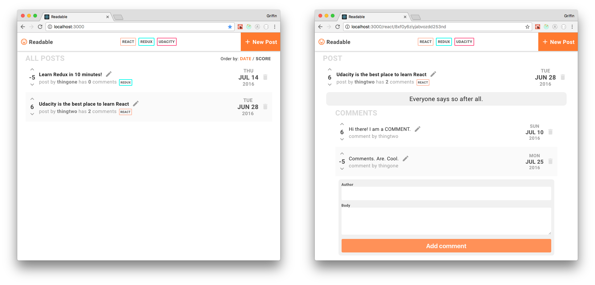

---

This project was made as a part of the [React Developer Udacity Nanodegree](https://www.udacity.com/course/react-nanodegree--nd019).

## To Run Locally

```bash
$ cd ~/Desktop
$ git clone https://github.com/griffinsockwell/reactnd-project-readable.git
$ cd reactnd-project-readable
```

Make sure [Node.js](https://nodejs.org/) is installed.

### To run the api-server

Change into the correct directory.
```bash
$ cd api-server
```

Install the node modules.
```bash
$ npm install
```

Start the development server.
```bash
$ node server
```

Information about the API server and how to use it can be found in its [README file](api-server/README.md).

### To run the frontend

Change into the correct directory.
```bash
$ cd frontend
```

Install the node modules.
```bash
$ npm install
```

Start the development server.
```bash
$ npm start
```
